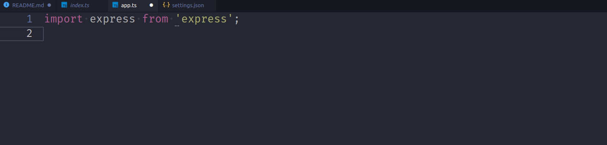
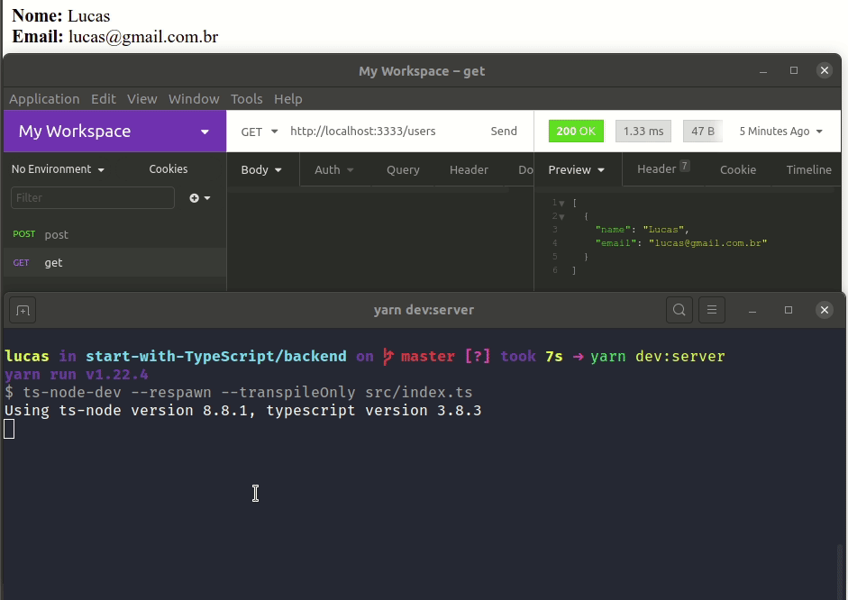

# Do que se trata esse repositório
Esse repositório será destinado para meus estudos sobre type-script.

Para começar eu gostaria de indicar dois links aqui:
- [Rocketseat - TypeScript: Vantagens, mitos, dicas e conceitos fundamentais](https://blog.rocketseat.com.br/typescript-vantagens-mitos-conceitos/)
- [Documentação TypeScript](https://www.typescriptlang.org/docs/handbook/basic-types.html)

# O que é TypeScript?
A grosso modo o typescript é o javascript com tipagem, e seus arquivos terminal com a extensão `.ts` ou `.tsx` para arquivos de projetos react. E ele trás certas vantagens em relação ao javascript, para entender um pouco dessas vantagens veja a função de soma abaixo:

```JavaScript
const sum = (a, b) => {
  return (a + b);
};
```

Se fizermos:

```JavaScript
sum(1,2);
```

Teremos como resposta o numero 3, mas e se fizermos:

```JavaScript
sum('string_1', 'string_2');
```

Teremos como resposta a concatenação de uma strin `string_1string_2`.

Claro que isso não é um imenso problema, se você estiver trabalhando em um projetinho pessoal, em que só você trabalha. Mas imagine que você está em um projeto gigante que se esse tipo de comportamento acontecer o sistema pode quebrar. E pior, imagine o trabalho que seria necessário para identificar um simples erro de tipagem. Por isso o typescript é muito bem vindo.

# Como utilizar
Tanto para node como para react, é necessário instalar o node, o yarn é opcional, você pode utilizar o npm para gerenciar os pacotes, eu prefiro o yarn.

- [node](https://nodejs.org/en/)
    ```shell
    $ sudo apt-get install curl

    $ curl -sL https://deb.nodesource.com/setup_12.x | sudo -E bash -

    $ sudo apt-get install -y nodejs
    ```

- [yarn](https://yarnpkg.com/)
    ```shell
    $ curl -sS https://dl.yarnpkg.com/debian/pubkey.gpg | sudo apt-key add -
    $ echo "deb https://dl.yarnpkg.com/debian/ stable main" | sudo tee /etc/apt/sources.list.d/yarn.list
    $ sudo apt-get update && sudo apt-get install yarn
    $ sudo apt-get update && sudo apt-get install --no-install-recommends yarn
    ```

## Node
Para uma aplicação node, o typescritp precisa ser instalado separadamente, assim como um interpretador para ele (que fará o mesmo papel que o nodemon faz no node convencional), esse interpretador é o `ts-node-dev`. Porém tanto o typescript quanto o ts-node-dev devem ser instalados como dependências de desenvolvimento, pois não existe nada que entenda typescript, tudo tem que ser convertido para js depois (papel do ts-node-dev), então em ambientes de produção não é necessásio instalar essas libs.

> OBS.: A poucos dias saiu a versão do [Deno](https://deno.land/) que é uma runtime (o node é uma runtime) para o TypeScritp e JavaScript, mas está na v1 e recém lançado, por isso vou seguir esse tutorial com o modo "classico" de utilizar typescript.

> OBS.: Utilizarei o ts-node-dev mas ele não é a única opção, também temos algumas outras, como o [sucrase](https://www.npmjs.com/package/sucrase).

- [typescript](https://www.typescriptlang.org/)
    ```shell
    $ yarn add typescript -D
    ```
- [ts-node-dev](https://www.npmjs.com/package/ts-node-dev)
    ```shell
    $ yarn add ts-node-dev -D
    ```

Lembrando que para iniciar uma aplicação node, basta digitar
```shell
yarn init -y
```

Agora para sua aplicação funcionar, você precisa escrever no package.json o seguinte:
```json
"scripts": {
    "dev:server": "ts-node-dev --respawn --transpileOnly src/index.ts"
},
```

Ai no terminal digite o comando
```shell
yarn dev:server
```

> OBS.: você pode dar outra key para esse item, ai ao em vez de digitar dev:start você digitaria outra coisa. E também presumi que o arquivo inicial do seu projeto estaria dentro de uma pasta src e teria o nome index.ts

## React
Com o react a coisa é um pouco mais simples, não é necessário instalar o typescript separadamente e nem um interpretador, o proprio `create react-app` já faz esse trabalho por nós. Basta digitar:

```shell
$ yarn create react-app `appName` --template=typescript
```

## React-Native
Instle o expo:
```shell
$ sudo npm install expo-cli --global
```

Assim como o react js no native também não precisamos fazer muitas coisas para especificar um projeto typescript. Basta executar o init do expo e escolher a opção de typescript

```shell
$ expo init $appName
```

> OBS.: Eu utilizo o expo para meus projetos, caso você não queria utilizar ele e opte por utilizar a cli do react-native, eu recomendo esse video [aqui](https://www.youtube.com/watch?v=XcU9GEUZTQA) da rocketseat, que vai te ajudar a iniciar com react-native sem o expo.

## Instalando Bibliotecas
Algumas bibliotecas não acompanham as tipagens junto com a lib principal, tipo o express, o que faz o seu editor de código não ter saber como auto completar as coisas para você, pois ele não consegue saber quais os métodos estão disponíveis para uma determinada classe que está chamando de dentro da biblioteca, por isso em alguns casos você precisará instalar esses tipos junto com a biblioteca desejada, no exemplo do express basta fazer:

```shell
$ yarn add express
$ yarn add @types/express -D
```
Veja que a parte do tipo também vai como dependência de desenvolvimento.

Para identificar quando é necessário fazer isso. Veja no gif abaixo, ao importar o express ele fica com `...` abaixo dele, e se passarmos o mouse por cima o vscode informa que é necessário instalar o `@types/express`, então sempre que for necessário o vscode irá avisar.



> Se você utiliza outro editor, então talvez ele avise de outra forma, ou você precisará procurar na documentação para saber se precisará instalar e o como fazer isso.

Um ponto importante, é que diferentemente do node, o typescript importa as bibliotecas utilizando a sintaxe de `import` mesmo no backend.

```TypeScript
import express from 'express';
```

## Configurando o lint
Considerando que você já é um desenvolvedor javaScript, então você provavelmente utiliza o `eslint`, e aqui vamos utilizar ele também. Eu configurarei de acordo com as configurações do airbnb.

Primeiramente instale o `eslint` e o `editor config`. No vscode você pode achar o mesmo no markteplace, ou instalar com o comando:
```shell
$ code --install-extension dbaeumer.vscode-eslint
code --install-extension EditorConfig.EditorConfig
```

- Crie o arquivo `.editorconfig`:
    ```conf
    root = true

    [*]
    indent_style = space
    indent_size = 2
    end_of_line = lf
    charset = utf-8
    trim_trailing_whitespace = true
    insert_final_newline = true
    ```

- Crie o arquivo `.eslintrc.js`:
    ```JavaScript
    module.exports = {
        env: {
            browser: true,
            es6: true,
            jest: true,
        },
        extends: [
            'airbnb',
            'plugin:@typescript-eslint/recommended',
            'prettier/@typescript-eslint',
        ],
        globals: {
            Atomics: 'readonly',
            SharedArrayBuffer: 'readonly',
        },
        parserOptions: {
            ecmaFeatures: {
                jsx: true,
            },
            ecmaVersion: 2018,
            sourceType: 'module',
        },
        plugins: ['react', 'import', 'jsx-a11y'],
        rules: {
            'react/jsx-filename-extension': [
                'error',
                {
                    extensions: ['.tsx'],
                },
            ],
            'import/prefer-default-export': 'off',
            '@typescript-eslint/explicit-function-return-type': 'off',
            '@typescript-eslint/explicit-member-accessibility': 'off',
            'import/extensions': [
                0,
                { ts: 'always', tsx: 'always' }
            ],
            'quotes': ["error", "single"],
            "arrow-body-style": ["error", "always"],
        },
        settings: {
            'import/parsers': {
                '@typescript-eslint/parser': ['.ts', '.tsx'],
            },
            'import/resolver': {
                typescript: {},
            },
        },
    };

    ```

Copie para a pasta do projeto os arquivos `.editorconfig` e `.eslintrc.js`.

### Dependências
instale em seu projeto as seguintes bibliotecas como dependências de desenvolvimento:

```shell
yarn add prettier -D
yarn add eslint -D
yarn add eslint-config-airbnb -D
yarn add eslint-plugin-import -D
yarn add eslint-config-prettier -D
yarn add eslint-plugin-prettier -D
yarn add @typescript-eslint/eslint-plugin -D
yarn add @typescript-eslint/parser -D
yarn add eslint-import-resolver-typescript -D
yarn add eslint-plugin-jsx-a11y -D
yarn add eslint-plugin-react -D
```

> OBS.: Pode acontecer de o eslint não funcionar de primeira, feche a aplicação e abra novamente para recarregar o vscode. Mas se ainda não der certo, então vai aparecer um icone triangular no canto inferior direito, escrito `Eslint` na frente, clique nele e veja o porque o eslint não funcionou. Normalmente quando é a primeira vez que está fazendo esse processo ele pode pedir para instalar o eslint de forma global na máquina.

# Declaração de variáveis
O typescript tem uma tipagem bem inteligênte (inferência de tipos), não sendo necessário declarar tipo toda vez que se declara uma variável, ele já consegue entender qual é o tipo da variável, e atribui um tipo a ela que não mudará com o decorrer da aplicação, e se você tentar mudar você receberá um aviso. Porém é possivel sim declarar o tipo de uma variável caso queira.

Os tipos básicos do typescript são: `number`, `string`, `boolean`, `void`, `null`, `undefined`, `any`, `never`, `Array`, `tuple`.

Abaixo temos alguns exemplos que peguei desse link [aqui](https://dzone.com/articles/what-are-the-basic-data-types-in-typescript), que explica melhor cada tipo.

```TypeScript
// number
let decimalValue: number = 10;
let hexaDecimalValue: number = 0xf10b;
let binaryValue: number = 0b110100;
let octalValue: number = 0o410;

// string
let firstName: string = "Kunal";

// boolean
let isPrimaryAccount: boolean = true;

// null
let nullValue: null = null;

// undefined
let undefinedValue: undefined = undefined;

// Array
let marks: number[] = [80, 85, 75];
let marks: Array<number> = [80, 85, 75];

// tuple
let person: [string, number] = ["Kunal", 2018];
```

# Funções
Quando se declara uma função com o typescript é necessário informar qual o tipo de cada atributo da função, e também ao retorno dela, tomando como base aquela nossa função de soma o modo de fazer isso é:

```TypeScript
const sum = (a: number, b: number): number => {
  return (a + b);
};
```

> Se por ventura não soubessemos o tipo que iria retornar da função, poderiamos utilizar o `void`. Mas é melhor que saiba o tipo de retorno.

# Tipos compostos
Assim como a linguagem C que tem as structures, o typescript possui alguns tipos compostos também. Mas eles estão longe de serem complicados.

## Interfaces
Para declarar uma interface faça:

```TypeScript
interface interfaceName {
    variable_1: basicType;
    variable_2: basicType;
    variable_n: basicType;
}
```

Para utilizar isso agora é a mesma coisa que com um tipo básico:

```TypeScript
const object : interfaceName = {
    value_1,
    value_2,
    value_n,
}
```

Ou até mesmo em uma função:
```TypeScript
interface ISum {
  a: number;
  b: number;
}

const sum = (values : ISum): number => {
  return (values.a + values.b);
};

const v: ISum = {
  a: 1,
  b: 2,
};

console.log(sum(v));
```

outra coisa legal de interfaces é que uma interface pode herdar outra:

```TypeScript
interface firstInterfaceName {
    variable_1: basicType;
    variable_2: basicType;
    variable_n: basicType;
};

interface secondInterfaceName {
    variable_1: firstInterfaceName;
    variable_2: basicType;
    variable_n: basicType;
};
```

ou até uma interface que extenda a outra

```TypeScript
interface firstInterfaceName {
    variable_1: basicType;
    variable_2: basicType;
    variable_n: basicType;
};

interface secondInterfaceName extends firstInterfaceName {
    variable_z: basicType;
};
```

Uma interface também pode ter entradas opcionais, ou seja, no exemplo acima podemos criar uma variável do tipo `firstInterfaceName` mas que não contenha o `variable_n`. Para isso precisamos modificar um pouco a interface colocando uma interrogação na variável opcional:

```TypeScript
interface firstInterfaceName {
    variable_1: basicType;
    variable_2: basicType;
    variable_n?: basicType;
};
```


## Types
Diferentemente das interfaces um type não pode ser herdado, porém ele pode conter multiplos tipos. Veja um exemplo:

```TypeScript
type Polygon =
  { type: 'square', x: number } |
  { type: 'circle', radius: number } |
  { type: 'rectangle', x: number, y: number };

function area(polygon: Polygon): number {
  switch (polygon.type) {
    case 'square':
      return (polygon.x ** 2);
    case 'circle':
      return (Math.PI * polygon.radius ** 2);
    case 'rectangle':
      return (polygon.x * polygon.y);
    default:
      return 0;
  }
};

console.log(area({
  type: 'square',
  x: 2,
}));
```

Nesse exemplo a area de um poligono pode ser calculada de formas diferentes de acordo com a geometria do objeto a ser calculado, então podemos ter entradas diferentes de acordo com o tipo de entrada.

## Enums
Servem para definir constantes. Um exemplo:

```TypeScript
enum Response {
  No = 0,
  Yes = 1
}

function respond(recipient: string, message: Response): void {
  console.log(recipient, message);
}

respond('Princess Caroline', Response.Yes);
```
o resultado disso vai ser `'Princess Caroline 1'`

# Fim
Basicamente o typescript é isso, existem ai algumas especificações para hooks do react, mas acaba sendo a mesma coisa que vimos aqui, e acaba sendo melhor ir pesquisando na internet conforme os erros aparecem. Por isso é importante configurar o `eslint` pois ele te ajudará nessa missão de aprender typescript.

Mas para te ajudar, eu deixei dois projetos aqui, um backend com node, e outro front end com react, ambos bem simples. A aplicação node simula um envio de email e a aplicação react seria a interface que consome essa api. Toda a aplicação foi feita juntamente com um tutorial da rocketseat, que você encontra [aqui](https://www.youtube.com/watch?v=0mYq5LrQN1s). E super recomendo dar uma olhada no video e acompanhar o canal deles, até porque anda tendo bastante conteúdo de typescript.

Para rodar as aplicações entre na pasta backend e digite no terminal:
```shell
$ yarn install
$ yarn dev:server
```

Abra outro terminal, entre na pasta frontend e digite:
```shell
$ yarn install
$ yarn start
```

## endpoints
- Endpoint get: `http://localhost:3333/users`
- Response: 
    ```JavaScript
        {
            name: 'Lucas',
            email: 'lucas@gmail.com.br',
        }
    ```
- Endpoint put: `http://localhost:3333/users`
- Response: foi
- console.log: email enviado para lucas@gmail.com.br Bem vindo

Pela aplicação react só fiz a parte do método get, para executar o método post na api utilize o [insomnia](https://insomnia.rest/) ou o [postman](https://www.postman.com/).


